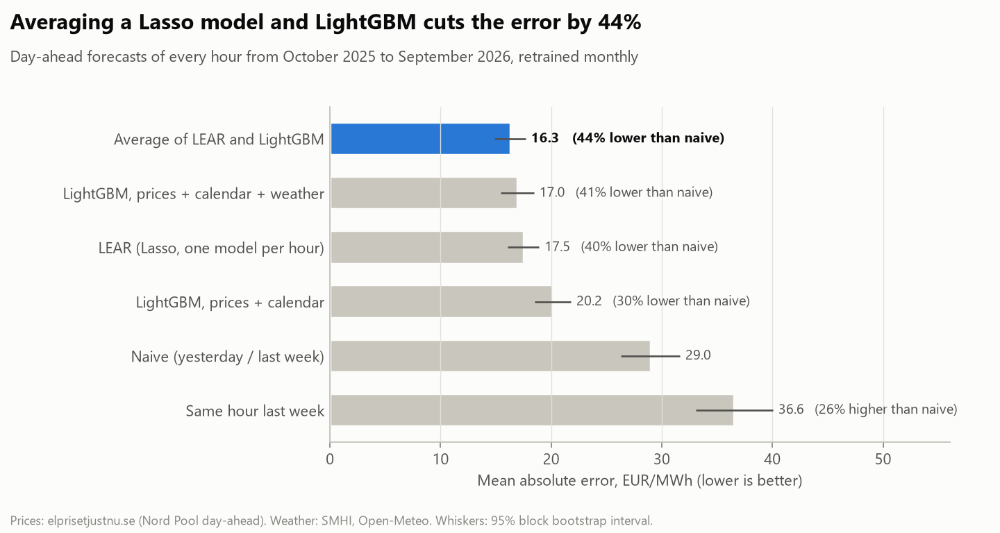
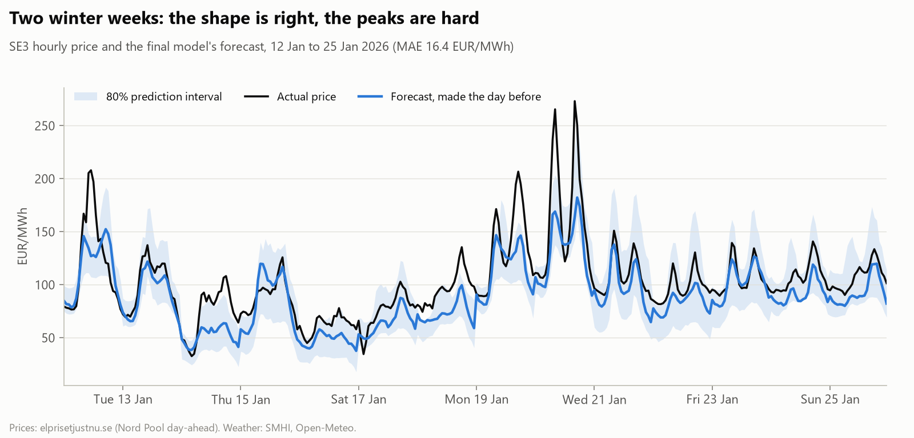
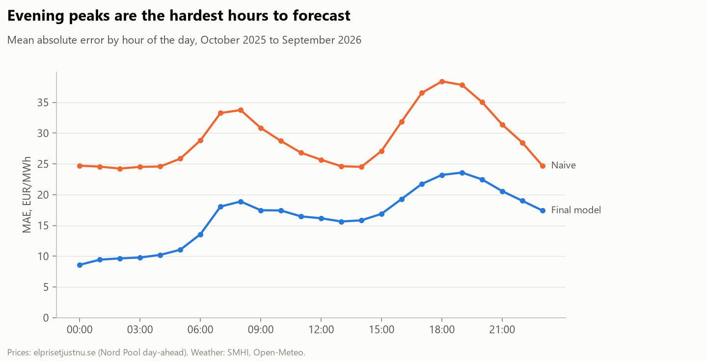
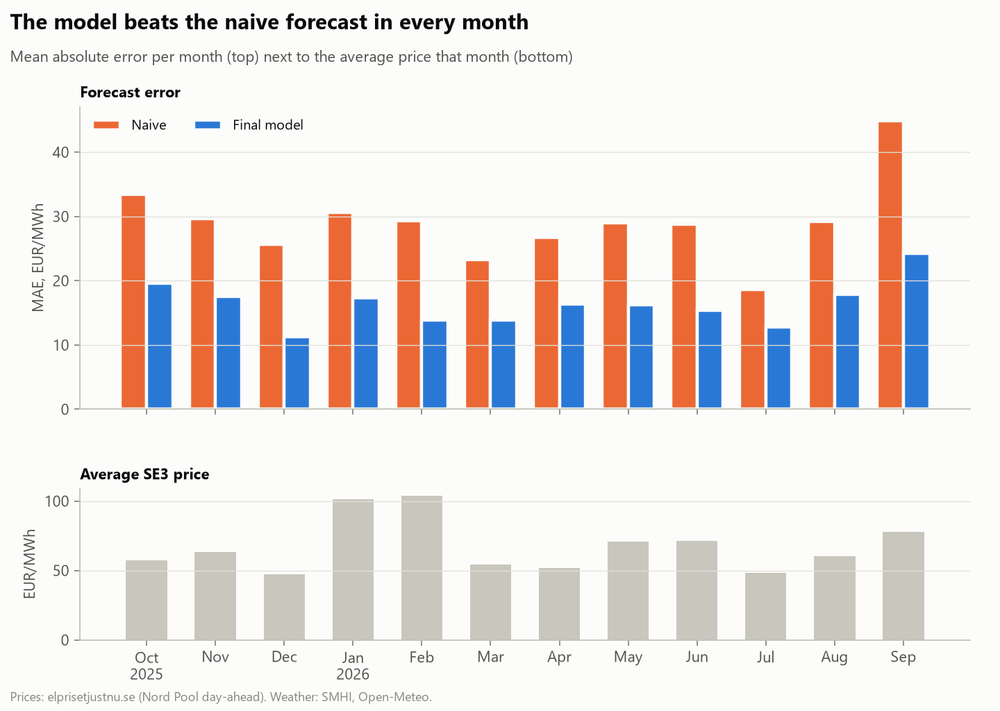
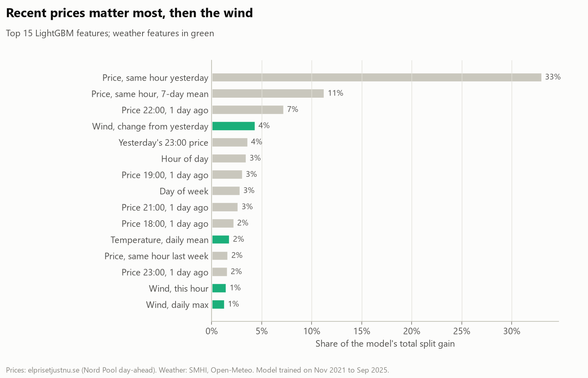
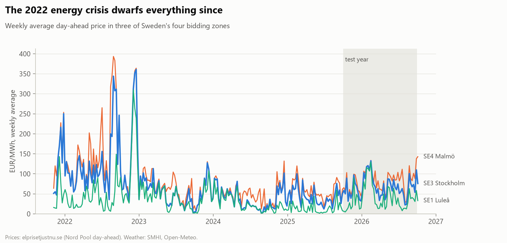
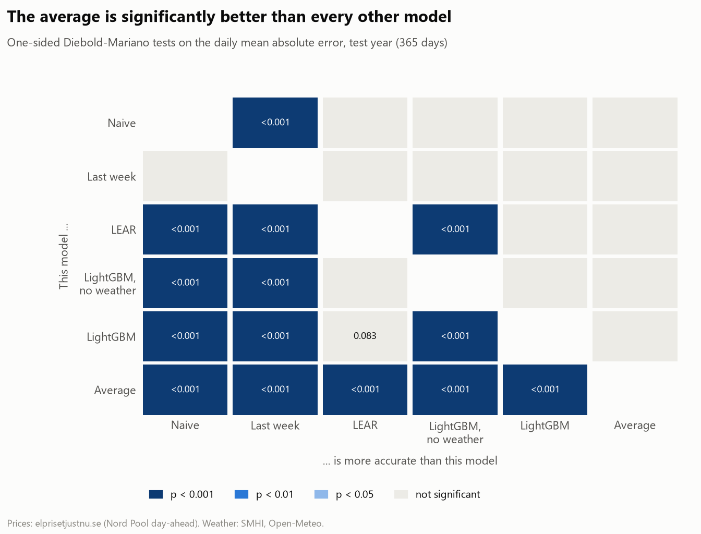

# Forecasting tomorrow's electricity price in Stockholm

**Day-ahead price forecasts for bidding zone SE3, backtested on a full year (October 2025 to September 2026) with only the information available before the noon auction.**

The final model, an average of a Lasso regression (LEAR) and LightGBM, misses the hourly price by **16.3 EUR/MWh** on average (about 18 öre/kWh), **44% less than the naive forecast** used as the standard benchmark (95% confidence interval 39% to 48%).
Prices averaged 67 EUR/MWh over the test year.
A scheduled GitHub Action makes a fresh forecast every morning and scores it once the real prices are out.



## Key findings

1. **Both model families beat the benchmark by about 40%; together they do better still.** LEAR (17.5 EUR/MWh) and LightGBM (17.0) make different mistakes, so their plain average (16.3) beats each of them. The same held on the validation year, which is where the choice was made. Diebold-Mariano tests confirm the average is significantly more accurate than LEAR, LightGBM and the baselines (all p < 0.001), while the gap between LEAR and LightGBM on their own is not significant (p = 0.08).
2. **Weather forecasts are worth a lot.** LightGBM without weather has an error of 20.2 EUR/MWh; adding forecast wind and temperature brings it to 17.0. The change in wind from yesterday is the most useful weather input, because yesterday's price already reflects yesterday's wind.
3. **Forecast weather beats perfect weather.** Feeding the model the weather that *actually* happened made it slightly worse (16.6 vs 16.3, Diebold-Mariano p = 0.04). Prices are set by bids, and the bidders only had the forecast too. The difference is small, and it was one comparison among many, so I read it as "observed weather does not help" rather than as a strong effect.
4. **Evening peaks are the hard part.** Errors are lowest at night (about 9 EUR/MWh) and highest between 17:00 and 20:00 (22 to 24). The most expensive 10% of hours are under-forecast by 33 EUR/MWh on average: spikes come from things the inputs do not see, such as a reactor outage or tight import capacity.
5. **The intervals are honest and sharp.** Raw LightGBM quantiles gave an "80%" interval that held only 64% of the prices. After conformal calibration it holds 80%, and it is still about a third narrower than a naive interval that holds only 75%, with an interval score of 82 against the naive interval's 147.
6. **Good enough to act on.** Charging an EV or running a heat pump in the three hours the forecast picks as cheapest costs 38 EUR/MWh on average, against 67 for the day as a whole and 34 for the three truly cheapest hours. The forecast captures 89% of the possible saving.



<details>
<summary><b>More charts</b></summary>






</details>

## Is the improvement real?

A lower average error on one year could be luck. Three checks, all in [`evaluation.py`](src/se3forecast/evaluation.py):

- **Diebold-Mariano tests** compare every pair of models on their daily errors (the mean absolute error over each day's 24 hours, as in [Lago et al., 2021](https://doi.org/10.1016/j.apenergy.2021.116983)), with the Harvey-Leybourne-Newbold small-sample correction. The test is paired: it asks whether one model is better *on the same days*, which is why the average can be significantly better than LightGBM even though their bootstrap intervals overlap.
- **Block bootstrap confidence intervals** for each model's error and its improvement over naive. The bootstrap resamples whole weeks, so a run of hard winter days stays together.
- **Proper scores for the intervals.** Pinball loss for the 10th and 90th percentiles and the Winkler interval score, which charges for width and heavily for misses. The baseline is the naive forecast plus the 10th and 90th percentiles of its own errors over the previous year, for that hour of the day.



| Model | MAE (EUR/MWh) | 95% CI | Improvement over naive | 95% CI |
|---|---:|---:|---:|---:|
| Naive | 29.0 | 26.3 to 31.6 | | |
| LEAR | 17.5 | 16.0 to 18.9 | 40% | 34% to 45% |
| LightGBM | 17.0 | 15.4 to 18.4 | 41% | 37% to 46% |
| **Average** | **16.3** | **14.8 to 17.7** | **44%** | **39% to 48%** |

| 80% interval | Coverage | Mean width (EUR/MWh) | Pinball loss q10 / q90 | Interval score |
|---|---:|---:|---:|---:|
| Naive + its past errors | 75% | 83 | 7.4 / 7.3 | 147 |
| LightGBM quantiles, raw | 64% | 41 | 3.7 / 5.0 | 87 |
| **LightGBM quantiles, conformal** | **80%** | **54** | **3.6 / 4.5** | **82** |

## The setup: no peeking at tomorrow

Bids for day *T* close at 12:00 on day *T-1*. At that point every price up to the end of *T-1* is known (it was set the day before), but nothing about *T*.

- **Prices:** every price feature is at least one day old. [`tests/test_features.py`](tests/test_features.py) changes the target day's prices by +1000 EUR/MWh and checks that no feature moves.
- **Weather:** observed weather for *T* is not known on *T-1*. The backtest instead uses **archived forecasts** from [Open-Meteo's previous-runs API](https://open-meteo.com/en/docs/previous-runs-api): the forecast issued 24 hours earlier for hours 00 to 11 (out before noon) and the one issued 48 hours earlier for hours 12 to 23. The models are trained on SMHI's observations and applied to the forecasts, as they would be in practice.
- **Validation, then test.** The point-forecast choices (training windows, which inputs, the ensemble) were made on October 2024 to September 2025, and the test year was run once with them fixed. One exception, stated openly: the first test run showed the raw intervals under-covering, so I added conformal calibration, checked it on the validation year (79% coverage) and re-ran the test. All models are retrained at the start of each month on everything before it.

## Models

| Model | Inputs | Test MAE (EUR/MWh) | vs naive |
|---|---|---:|---:|
| Naive | Same hour yesterday; same hour last week on Mondays and weekends ([Lago et al., 2021](https://doi.org/10.1016/j.apenergy.2021.116983)) | 29.0 | |
| Same hour last week | Weekly seasonal naive | 36.6 | +26% |
| LEAR | One Lasso per hour on asinh prices of 1, 2, 3 and 7 days back, other zones, weather, weekday; penalty chosen by AIC; last 2 years | 17.5 | −40% |
| LightGBM, no weather | Same-hour lags, yesterday's level and shape, all 96 lagged hourly prices, other zones, calendar, holidays | 20.2 | −30% |
| LightGBM | The same plus forecast temperature and wind | 17.0 | −41% |
| **Average of LEAR and LightGBM** | | **16.3** | **−44%** |

Both models work on an `asinh` scale of the robustly standardised price. It behaves like a log for large values, handles the negative prices of windy summer days, and stops the 2022 crisis (up to 800 EUR/MWh) from dominating training. The 80% interval comes from LightGBM quantile models widened by split conformal calibration on the last 90 days of each training window ([Romano et al., 2019](https://arxiv.org/abs/1905.03222)).

## Daily live forecast

[`forecast.yml`](.github/workflows/forecast.yml) runs every morning at 07:30 UTC. It refreshes the data, retrains on all history, forecasts the next day without published prices using Open-Meteo's latest weather forecast, and commits the result to [`forecasts/`](forecasts):

- [`latest.csv`](forecasts/latest.csv): the newest forecast with its 80% interval
- `log.csv`: every forecast made before its auction
- `live_scores.csv`: daily error once the actual prices are known

To run it by hand: `python -m se3forecast.forecast`.

## Streamlit dashboard

Tomorrow's forecast, the backtest for any model and period with hover tooltips, and the price history of all four zones.

```bash
streamlit run app/streamlit_app.py
```

## How it works

```
elprisetjustnu.se  ─┐
SMHI observations  ─┼─►  ingest.py  ──►  sql/*.sql (DuckDB)  ──►  features.py  ──►  backtest.py  ──►  figures.py / notebook / Streamlit
Open-Meteo archive ─┘    raw files        hourly table             day-ahead          monthly            
                                                                   features           retraining   ──►  forecast.py (daily Action)
```

1. **Ingest** ([`ingest.py`](src/se3forecast/ingest.py)). Day-ahead prices for SE1 to SE4 from November 2021, one JSON file per zone and day from the [elprisetjustnu.se API](https://www.elprisetjustnu.se/elpris-api), cached by month. Hourly temperature at Stockholm Observatoriekullen and wind speed at six stations near Sweden's wind farms (Göteborg, Hallands Väderö, Öland, Gävle, Sundsvall, Östersund) from [SMHI's open data](https://opendata.smhi.se/metobs/introduction). Archived weather forecasts for the same seven places from Open-Meteo.
2. **Build an hourly table in SQL** ([`sql/`](sql), [`build.py`](src/se3forecast/build.py)). DuckDB converts UTC timestamps to Swedish local time, averages the 15-minute prices introduced on 1 October 2025 to hours, averages the repeated hour on the autumn daylight-saving day and fills the missing spring hour.
3. **Features** ([`features.py`](src/se3forecast/features.py)). Prices of the same hour 1, 2, 3 and 7 days back, the 7-day mean and spread of that hour, yesterday's mean, minimum, maximum and last hour, yesterday's prices in SE1, SE2 and SE4 and the spreads between zones, the full 24-hour profile of earlier days, weather for the target day and its change from yesterday, and calendar features including Swedish public holidays and the eves when most workplaces close (Midsummer, Christmas and New Year's Eve).
4. **Backtest** ([`backtest.py`](src/se3forecast/backtest.py), [`models.py`](src/se3forecast/models.py)). Rolling origin with monthly retraining; metrics are MAE, RMSE, bias and MAE relative to the naive benchmark (rMAE).
5. **Evaluate** ([`evaluation.py`](src/se3forecast/evaluation.py)). Diebold-Mariano tests, block bootstrap confidence intervals and interval scores.
6. **Analyse** in [`notebooks/analysis.ipynb`](notebooks/analysis.ipynb), which reads only the small processed files.

## Limitations

- **No market fundamentals beyond weather.** Nuclear availability, hydro reservoir levels, gas and carbon prices and interconnector capacity all move SE3 prices, but the data (ENTSO-E, Nord Pool market messages) needs registration. They would most likely help most with spikes.
- **A simple wind index.** An unweighted mean of six stations; one weighted by installed capacity would be better. Solar is not modelled.
- **Not the forecasts traders use.** Open-Meteo's best-match model stands in for commercial weather forecasts, and its archive starts in 2024, so the models are trained on observed weather.
- **Forecasts are pulled towards the middle.** Good for average error, but the most extreme hours are under-forecast.
- **Hourly, not 15-minute.** Since October 2025 the market clears per quarter hour; this project forecasts hourly averages.

## Run it yourself

Requires Python 3.11 or newer.

```bash
python -m venv .venv
source .venv/bin/activate        # Windows: .venv\Scripts\activate
pip install -r requirements.txt
```

The processed data is in the repo, so the dashboard, notebook and charts work straight away. To rebuild everything (downloads about 7,000 small files, a few minutes):

```bash
export PYTHONPATH=src                  # Windows PowerShell: $env:PYTHONPATH="src"
python -m se3forecast.ingest           # prices, weather observations and archived forecasts
python -m se3forecast.build            # hourly table via DuckDB
python -m se3forecast.backtest --validation   # model choices, about 4 minutes
python -m se3forecast.backtest         # test year, about 4 minutes
python -m se3forecast.evaluation       # significance tests and interval scores
python -m se3forecast.figures          # redraw the charts
pytest
```

## Project structure

```
├── .github/workflows/        tests, and the daily forecast
├── app/streamlit_app.py      interactive dashboard
├── data/processed/           hourly table, backtest predictions, metrics and significance tests
├── forecasts/                live forecasts and their scores
├── notebooks/analysis.ipynb  walkthrough of the analysis
├── reports/figures/          charts used in this README
├── sql/                      DuckDB queries for the hourly table
├── src/se3forecast/          ingest, build, features, models, backtest, evaluation, figures, forecast
└── tests/                    leakage, feature, model, evaluation and dashboard tests
```

## Sammanfattning på svenska

Projektet prognostiserar morgondagens timpriser på el i elområde SE3 (Stockholm) innan Nord Pools auktion stänger klockan 12. Det bygger på öppna data: spotpriser från elprisetjustnu.se, väderobservationer från SMHI och arkiverade väderprognoser från Open-Meteo. Ett medelvärde av en Lasso-modell (LEAR) och LightGBM missar timpriset med i genomsnitt 16,3 EUR/MWh (cirka 18 öre/kWh) under teståret oktober 2025 till september 2026, vilket är 44 % bättre än en naiv prognos (95 % konfidensintervall 39–48 %, statistiskt säkerställt med Diebold-Mariano-test). Vindprognoser förbättrar träffsäkerheten tydligt, och kvällstopparna är svårast att förutse. En schemalagd GitHub Action gör en ny prognos varje morgon.

## Data and licence

Prices: [elprisetjustnu.se](https://www.elprisetjustnu.se/elpris-api) (Nord Pool day-ahead prices). Weather observations: [SMHI](https://www.smhi.se/data/oppna-data/villkor-for-anvandning), CC BY 4.0. Archived and live weather forecasts: [Open-Meteo](https://open-meteo.com/en/license), CC BY 4.0. Code: MIT licence.
